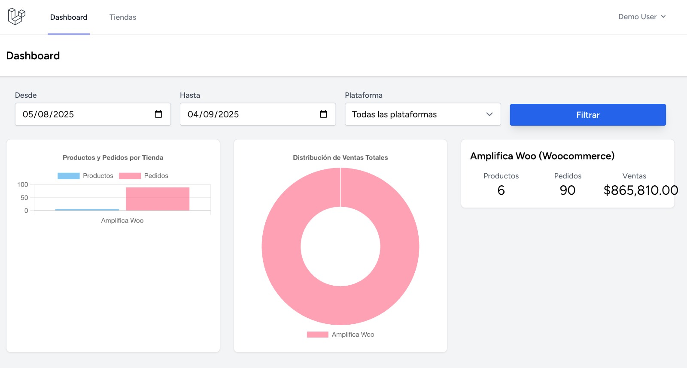
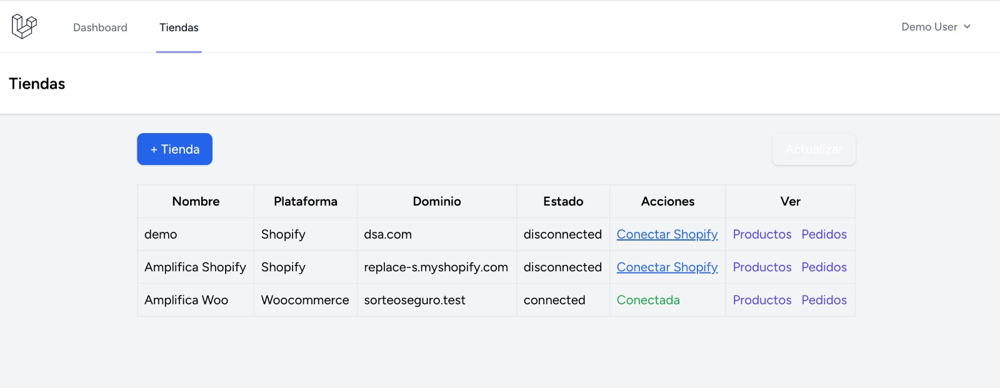
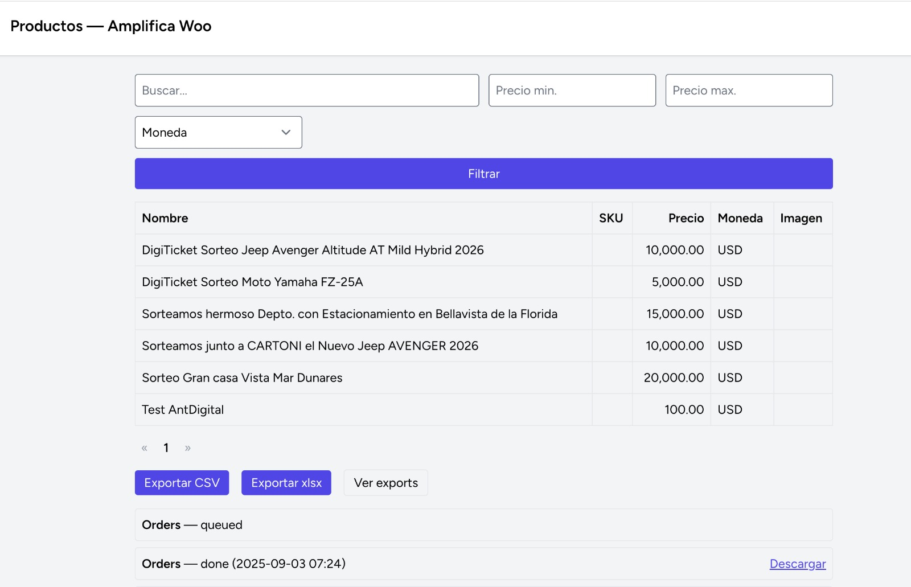

# Proyecto Laravel para conectar a ecommerces externos.

# Requisitos
- PHP 8.0 o superior
- Composer
- Node.js y npm
- MySQL o MariaDB

# Clonar y configurar
Clonar el repositorio 
```bash
git clone git@github.com:usuario/tu-repo.git
cd tu-repo
```
Crear y editar el archivo de entorno 
```bash
cp .env.example .env
```
Ajustar en .env los valores de DB_DATABASE, DB_USERNAME y DB_PASSWORD.

# Instalación de dependencias
```bash
composer install 
npm install
```

# Generar clave y compilar assets
Generar la clave de la aplicación 
```bash
php artisan key:generate
```

Compilar assets para desarrollo 
```bash
npm run dev
```

Compilar assets para producción 
```bash
npm run build
```

# Base de datos
```bash
php artisan migrate --seed
```

# Levantar el servidor
```bash
php artisan serve
```

# Testing

Configurar conexión de prueba en .env.testing (opcional) copiar .env.example a .env.testing y ajustar DB_DATABASE_TEST, etc.

```bash
php artisan test 
```

# Jobs

Configurar/Verificar driver de colas en .env QUEUE_CONNECTION=database

```bash
php artisan queue:work --once
```

Para pruebas automáticas de jobs incluir dispatch dentro de tests y usar driver sync en .env.testing


# Instrucción de uso
- Navegar a http://localhost:8000/
- Registrar o iniciar sesión.
- En el listado Tiendas (previamente registrar o editar alguna) al momento de conectar solicitará las credenciales de woocommerce o shopify. Realizado esto se podrá mostrar o sincronizar los productos y pedidos desde el store externo.
- Las descargas de xlsx o csv se gestiona con jobs. Para ellos correr los jobs. 

# Imágenes de referencia:




